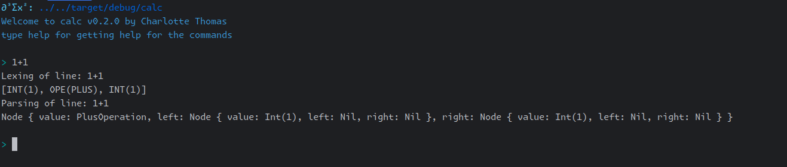

# Calc

**Calc: a minimalistic calculator built for educational purpose only.**

## TODO List

- [X] Lexing of basic operations
    - [X] Lexing operators
    - [X] Lexing lpar,rpar,quote
    - [X] Lexing int
    - [X] Lexing floats
    - [X] Lexing identifiers
- [X] Parsing of basic operations
    - [X] Parsing int,floats,identifiers
    - [X] sum operation
    - [X] minus operation
    - [X] multiplication operation
    - [X] division operation
- [ ] Parsing advanced operations
    - [ ] Parsing lpar,rpar
    - [ ] mathematical priority
    - [ ] parenthesis support
    - [ ] associativity support
    - [ ] hidden multiplication support
- [X] Application REPL
    - [X] Add the REPL
        - [X] basic REPL
        - [X] colour message
        - [X] colourised prompt
    - [X] Add colour
- [ ] Config
    - [ ] Config parser
    - [ ] Config colours
    - [ ] Config prompt
- [ ] Add support for functions
    - [ ] exp
    - [ ] ln
    - [ ] log base a
    - [ ] cos/sin/tan
    - [ ] cosh/sinh/tanh
- [ ] Defining your own functions
- [ ] Add RPN mode

## Examples

### REPL with only Lexing (verbose mode: on by default)

### REPL with lexing and basic operation parsing (verbose mode: on by default)

## Configuration