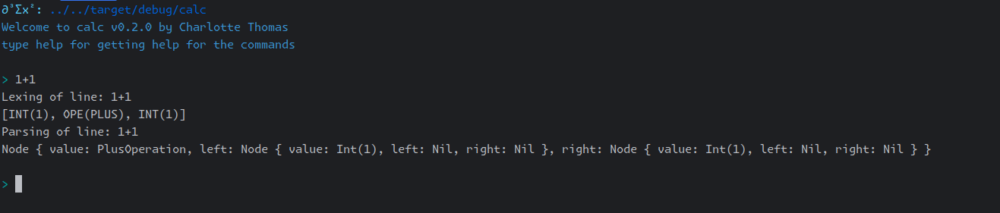

# Calc

**Calc: a minimalistic calculator built in rust for educational purpose only.**

[](https://github.com/coco33920/calc/actions/workflows/rust-test.yml)
[](https://github.com/coco33920/calc/releases/latest)

## Install

You can install the latest version from source

```bash 
git clone https://github.com/coco33920/calc
cd calc 
cargo build --release
./target/release/mini-calc
```

or install it via cargo

```bash 
cargo install mini-calc
```

## TODO List

- [X] Lexing of basic operations
    - [X] Lexing operators
    - [X] Lexing lpar,rpar,quote
    - [X] Lexing int
    - [X] Lexing floats
    - [X] Lexing identifiers
- [X] Parsing of basic operations
    - [X] Parsing int,floats,identifiers
    - [X] sum operation
    - [X] minus operation
    - [X] multiplication operation
    - [X] division operation
- [ ] Parsing advanced operations
    - [X] Parsing lpar,rpar
    - [X] mathematical priority
    - [X] parenthesis support
    - [X] Assignment
    - [ ] associativity support
- [X] Application REPL
    - [X] Add the REPL
        - [X] basic REPL
        - [X] colour message
        - [X] colourised prompt
    - [X] Add colour
- [X] Interpreter
    - [X] Basic operation interpreter
    - [X] Advanced operation interpreter
    - [X] Identifiers (variable) interpreter
- [ ] Config
    - [ ] Config colours
    - [ ] Config prompt
- [ ] Add support for functions
    - [ ] exp
    - [ ] ln
    - [ ] log base a
    - [ ] cos/sin/tan
    - [ ] cosh/sinh/tanh
- [ ] For later
    - [ ] Defining your own functions
    - [ ] Add RPN mode
    - [ ] Hidden multiplication

## Examples

### REPL with only Lexing (verbose mode: on by default)


### REPL with lexing and basic operation parsing (verbose mode: on by default)



### REPL and functionning interpreter (verbose mode: off by default)


## Configuration