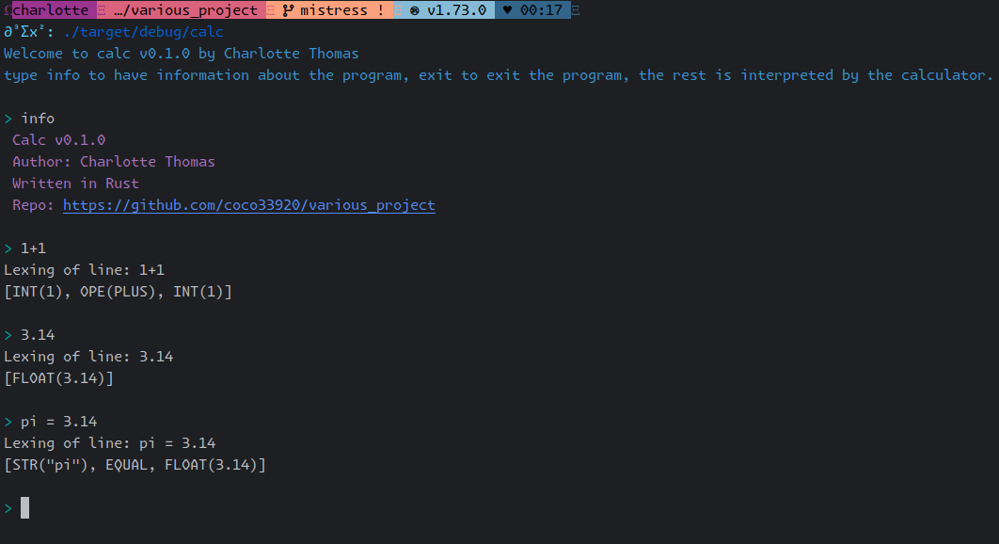
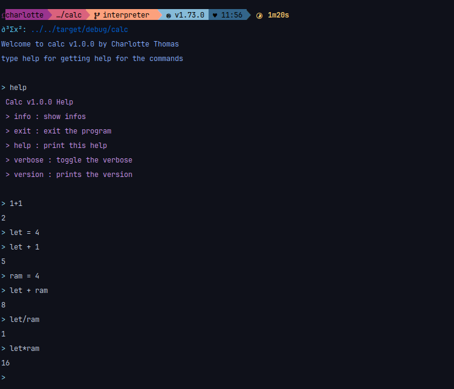
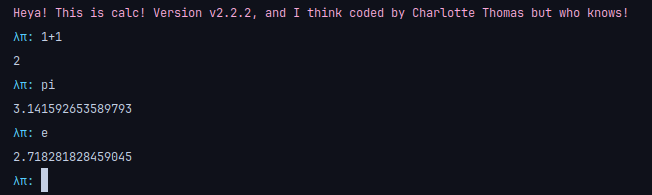
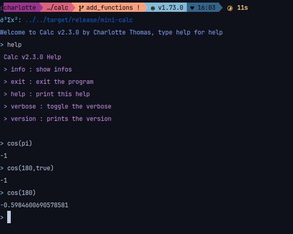

# Calc

<div align="center">

**Calc: a minimalistic calculator built in rust for educational purpose only.**

[](https://github.com/coco33920/calc/actions/workflows/rust-test.yml)
[](https://github.com/coco33920/calc/releases/latest)
[](https://crates.io/crates/mini-calc)


</div>

## Install

You can install the latest version from source

```bash 
git clone https://github.com/coco33920/calc
cd calc 
cargo build --release
./target/release/mini-calc
```

or install it via cargo

```bash 
cargo install mini-calc
```

## Explaining

Check [the website](https://calc.nwa2coco.fr) for more informations.

## TODO List

- [X] Lexing of basic operations
    - [X] Lexing operators
    - [X] Lexing lpar,rpar,quote
    - [X] Lexing int
    - [X] Lexing floats
    - [X] Lexing identifiers
- [X] Parsing of basic operations
    - [X] Parsing int,floats,identifiers
    - [X] sum operation
    - [X] minus operation
    - [X] multiplication operation
    - [X] division operation
- [X] Parsing advanced operations
    - [X] Parsing lpar,rpar
    - [X] mathematical priority
        - [X] Left priority
        - [X] Right priority
    - [X] parenthesis support
    - [X] Assignment
    - [X] associativity support
        - [X] Left associativity
        - [X] Right associativity
- [X] Application REPL
    - [X] Add the REPL
        - [X] basic REPL
        - [X] colour message
        - [X] colourised prompt
    - [X] Add colour
- [X] Interpreter
    - [X] Basic operation interpreter
    - [X] Advanced operation interpreter
    - [X] Identifiers (variable) interpreter
- [X] Built-in
    - [X] pi
    - [X] e
- [X] Config
    - [X] Config colours
    - [X] Config prompt
- [X] Add more operations
    - [X] exponent
- [X] Add support for functions
    - [X] exp
    - [X] ln
    - [X] log base a
    - [X] cos/sin/tan
    - [X] cosh/sinh/tanh
    - [X] atan/acos/asin
- [X] Add logic
    - [X] Add basic true/false
    - [X] Add binary operator
        - [X] or (&&)
        - [X] and (||)
        - [X] `>=`
        - [X] `>`
        - [X] `<=`
        - [X] `<`
        - [X] `==`
    - [X] Add unary operator
        - [X] not (!)
- [ ] For later
    - [ ] Defining your own functions
    - [ ] Add RPN mode
    - [ ] Hidden multiplication

## Examples

### REPL with only Lexing (verbose mode: on by default)



### REPL with lexing and basic operation parsing (verbose mode: on by default)


### REPL and functionning interpreter (verbose mode: off by default)



## Configuration

You can configure the general color, greeting message, greeting color, prompt and prompt color from the file for example
in (for linux)

```
~/.config/mini-calc/mini-calc.toml
```

Or situated in your operating system config folder.

### What the configuration looks like

The default configuration looks like this


### Colors

Available colors are

- purple
- cyan
- blue
- black
- red
- yellow
- green
- white
- an hexadecimal colour (ex: "#f7a8d8")

Default colour (if the configuration fail to load) is Cyan.

### Example of a modified configuration

Configuration:


It looks like:



## Functions

The following functions are available

- sin
- cos
- tan
- sinh
- cosh
- tanh
- asin
- acos
- atan
- exp
- ln
- log (alias of ln)
- sqrt
- factorial (aliases: fact)
- abs
- ceil
- floor
- round

### Trigonometry

For trigonometry, the input are assumed to be in radian, if not, you have to put "false" or "true" as second argument,
example shown bellow



### Exp/ln

If you use the exp function you can pass a second argument for the base you are using, if no second arguments are passed
this is assumed to be in natural base


### Root

You can take the nth root with the sqrt function, by default it takes the second root.


### Round

You can round to the nth decimal with the round function, by default it round to the integer (floor)


## Logic

You can now use logic! I implemented the following functions:

- or (alias : ||)
- and (alias : &&)
- geq (alias : `>=`)
- gt (alias : `>`)
- leq (alias : `<=`)
- lt (alias :`<`)
- eq (alias : `==`)

Example:


