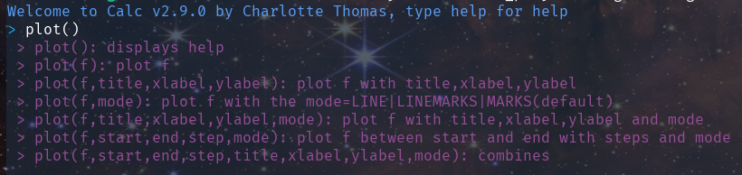
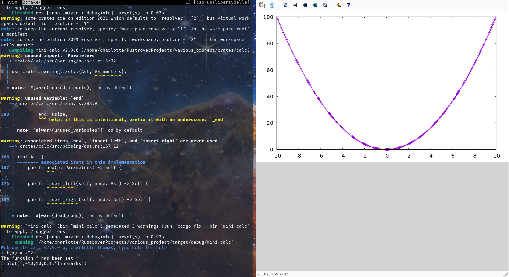
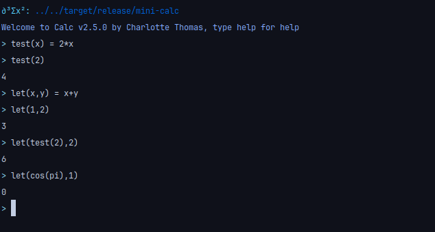

# Calc

<div align="center">

**Calc: A fully-featured minimalistic configurable rust calculator**

[](https://github.com/coco33920/calc/actions/workflows/rust-test.yml)
[](https://github.com/coco33920/calc/releases/latest)
[](https://crates.io/crates/mini-calc)

[](https://crates.io/crates/mini-calc)

</div>

## Install

You can install the latest version from source

```bash 
git clone https://github.com/coco33920/calc
cd calc 
cargo build --release
./target/release/mini-calc
```

or install it via cargo

```bash 
cargo install mini-calc
```

## Website
The website (powered by oranda) is available for more informations [the website](https://calc.nwa2coco.fr) for more informations.

## Contributors

|                                                                                                                                               | Name    | Role                     | Website                                     |
|-------------------------------------------------------------------------------------------------------------------------------------------------|:--------|:-------------------------|:--------------------------------------------|
| [](https://github.com/coco33920)        |Charlotte THOMAS          | Main developer/Maintener | [Main page](https://me.nwa2coco.fr)         | 
| [](https://github.com/leana8959)        |Léana 江                  | Help, cleanup            | [Website/Blog](https://earth2077.fr)        |


## TODO List

The TODO list is completed so I collapsed it
<details> 
<summary>TODO List</summary>

- [X] Lexing of basic operations
    - [X] Lexing operators
    - [X] Lexing lpar,rpar,quote
    - [X] Lexing int
    - [X] Lexing floats
    - [X] Lexing identifiers
- [X] Parsing of basic operations
    - [X] Parsing int,floats,identifiers
    - [X] sum operation
    - [X] minus operation
    - [X] multiplication operation
    - [X] division operation
- [X] Parsing advanced operations
    - [X] Parsing lpar,rpar
    - [X] mathematical priority
        - [X] Left priority
        - [X] Right priority
    - [X] parenthesis support
    - [X] Assignment
    - [X] associativity support
        - [X] Left associativity
        - [X] Right associativity
- [X] Application REPL
    - [X] Add the REPL
        - [X] basic REPL
        - [X] colour message
        - [X] colourised prompt
    - [X] Add colour
- [X] Interpreter
    - [X] Basic operation interpreter
    - [X] Advanced operation interpreter
    - [X] Identifiers (variable) interpreter
- [X] Built-in
    - [X] pi
    - [X] e
- [X] Config
    - [X] Config colours
    - [X] Config prompt
- [X] Add more operations
    - [X] exponent
- [X] Add support for functions
    - [X] exp
    - [X] ln
    - [X] log base a
    - [X] cos/sin/tan
    - [X] cosh/sinh/tanh
    - [X] atan/acos/asin
- [X] Add logic
    - [X] Add basic true/false
    - [X] Add binary operator
        - [X] or (&&)
        - [X] and (||)
        - [X] `>=`
        - [X] `>`
        - [X] `<=`
        - [X] `<`
        - [X] `==`
    - [X] Add unary operator
        - [X] not (!)
- [X] Vector calculation
    - [X] Add vectors to the datatypes
    - [X] Lex vectors
    - [X] Parse vectors
    - [X] Add vector operations
      - [X] Dot product
      - [X] Vector norm
      - [X] Vector addition
- [X] Matrix calculation
    - [X] Add matrix to the datatypes
    - [X] Lex matrices
    - [X] Parse matrices
    - [X] Add matrices operation
      - [X] Matrix addition
      - [X] Matrix multiplication
      - [X] Calculate the matrix determinant
      - [X] Calculate the reverse matrix
- [X] Interact with the configuration
    - [X] Print current config
    - [X] Reset config to default
    - [X] Set config
      - [X] Set main color
      - [X] Set prompt color
      - [X] Set prompt 
      - [X] Set greeting message
      - [X] Set greeting color 
    - [X] Reload config
</details>

## Evolution

### Ploting

Plot functions (both stdlib, and runtime) would be useful and appreciated.
Plotting is powered by gnuplot, it will works on Unix-like (MacOS, Linux) but I don't have any idea about Windows

- [X] Plot stdlib functions
- [X] Plot runtime functions
- [X] Save plot to png/svg/pdf

- [X] Add terminal ploting
    - [X] Calculate ploting height and width
    - [X] Computes individual points
    - [X] Generate each line
    - [X] Prints each line

- [X] Auto level x axis in termplot
- [X] Auto level y axis in termplot

#### Example of plotting

You can plot function defined in the standard library of calc or user defined functions, to display the help just type `plot()`



You can then plot for example

Plotting cos with the default values (from 0 to 3pi, with a step of 0.01pi)


Plotting sin with custom values (from -pi to pi, with a step of 0.01rad, with line, title, x label, y label)


Defining f(x) = x² and plotting it with custom values (from -10 to 10, with a step of 0.1, with linespoint)



#### Example of terminal plotting

You can plot in the terminal, for example 


And it supports the labels too


And now it auto scales on y!


### Exact math calculator

As this project provides a frontend with a parser we could plug an exact math engine in the backend to transform `calc` into a 
real exact math calculator.
TODO List for the Exact Math Engine

- [X] Rational calculation
  - [X] Implement rational numbers operations 
  - [X] Rational reduction
- [ ] Irrational calculation 
  - [ ] Implement irrational numbers operations
  - [ ] Irrational reduction
- [ ] Literal calculation
  - [ ] Computes literal expression with uninitialized operators
  - [ ] Literal reduction

#### Example of rational computations

As of 2.11.0 the support for rational exact math has been implemented


As of 2.11.1 it works in matrices!


As of 2.11.4 floats are automatically rationalized (with 10 decimal points of precision)


### CAS

If we ever go to this step, yes, I will remove the "minimalistic" from the description
- [ ] It's hard.

## Examples

### REPL with only Lexing (verbose mode: on by default)


### REPL with lexing and basic operation parsing (verbose mode: on by default)


### REPL and functionning interpreter (verbose mode: off by default)


## Configuration

You can configure the general color, greeting message, greeting color, prompt and prompt color from the file for example
in (for linux)

```
~/.config/mini-calc/mini-calc.toml
```

Or situated in your operating system config folder.


You can interact with the configuration with the command line, more info in [the web page](https://calc.nwa2coco.fr/config.html)


### What the configuration looks like

The default configuration looks like this


### Colors

Available colors are

- purple
- cyan
- blue
- black
- red
- yellow
- green
- white
- an hexadecimal colour (ex: "#f7a8d8")

Default colour (if the configuration fail to load) is Cyan.

### Example of a modified configuration

Configuration:


It looks like:


## Functions

The following functions are available

- sin
- cos
- tan
- sinh
- cosh
- tanh
- asin
- acos
- atan
- exp
- ln (alias: log)
- sqrt
- factorial (alias: fact)
- abs
- ceil
- floor
- round

### Trigonometry

For trigonometry, the input are assumed to be in radian, if not, you have to put "false" or "true" as second argument,
example shown bellow


### Exp/ln

If you use the exp function you can pass a second argument for the base you are using, if no second arguments are passed
this is assumed to be in natural base


### Root

You can take the nth root with the sqrt function, by default it takes the second root.


### Round

You can round to the nth decimal with the round function, by default it round to the integer (floor)


### Vectorization 

Function are now vectorized! Just pass a vector as an argument!


## Logic

You can now use logic! I implemented the following functions:

- or (alias : ||)
- and (alias : &&)
- geq (alias : `>=`)
- gt (alias : `>`)
- leq (alias : `<=`)
- lt (alias :`<`)
- eq (alias : `==`)

Example:


## User defined functions!

You can define your own functions!



## Vector calculation !

You can use vectors! 

- add vector to each others
- added the `norm` function to compute the norm
- dot product between two vectors ( * operator)

Functions added: 
- norm


## Matrices !

As of 2.7.0 matrix algebra is implemented (using lup reduction)

- you can add matrices 
- multiply compatible matrices

functions added
- transpose
- invert
- det 


As of 2.11.3 matrices are pretty printed !


