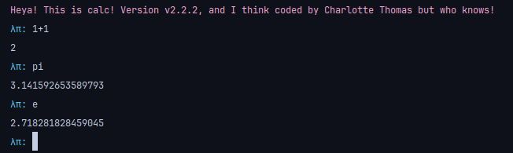

# Configuration

You can configure the general color, greeting message, greeting color, prompt and prompt color from the file for example in (for linux)
```
~/.config/mini-calc/mini-calc.toml
```
Or situated in your operating system config folder.

### What the configuration looks like

The default configuration looks like this


### Colors
Available colors are

- purple
- cyan
- blue
- black
- red
- yellow
- green
- white
- an hexadecimal colour (ex: "#f7a8d8")

Default colour (if the configuration fail to load) is Cyan.

### Example of a modified configuration

Configuration:


It looks like:



## Interact in the command line

You can interact and modify the config from the command line the commands are
- config: show the current config
- config reload: reload the config
- config reset: reset the config to default parameters
- config set <category> <value>

categories are :
- `greeting_message`
- `greeting_color`
- `prompt_color`
- `prompt`
- `general_color`


