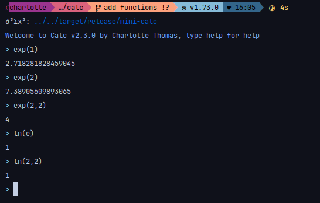

# Functions

The following functions are available

Trigonometry
- sin
- cos
- tan

Hyperbolic trigonometry
- sinh
- cosh
- tanh

Reverse trigonometry
- asin
- acos
- atan

Exponentiation
- exp
- ln
- log (alias of ln)

## Trigonometry

For trigonometry, the input are assumed to be in radian, if not, you have to put "false" or "true" as second argument, example shown bellow

## Exp/ln

If you use the exp function you can pass a second argument for the base you are using, if no second arguments are passed this is assumed to be in natural base

