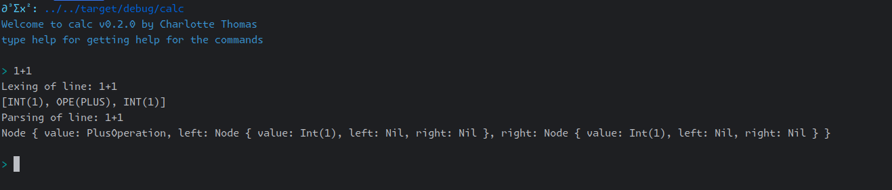

# Calc

<div align="center">

<span style="font-weight:bold">Calc: a fully-featured minimalistic calculator built in rust for educational purpose only.</span>
<br/>
<a href="https://github.com/coco33920/calc/actions/workflows/rust-test.yml"></a>
<a href="https://github.com/coco33920/calc/releases/latest"></a>
<a href="https://crates.io/crates/mini-calc"></a>
<a href="https://github.com/coco33920/calc/blob/master/LICENSE"></a>

</div>

## Install

You can install the latest version from source

```bash 
git clone https://github.com/coco33920/calc
cd calc 
cargo build --release
./target/release/mini-calc
```

or install it via cargo

```bash 
cargo install mini-calc
```

## Usage

You can see how the calculator works over at [the usage page](usage.md)

## Config

An overview of the configuration of mini-calc can be found [here](config.md)

## Function 

An overview of the function of mini-calc can be found [here](function.md) 

## Logic

To learn about the binary logic built in go to the [logic page](logic.md)

## User defined functions

You can define your own functions!


## TODO List

- [X] Lexing of basic operations
  - [X] Lexing operators
  - [X] Lexing lpar,rpar,quote
  - [X] Lexing int
  - [X] Lexing floats
  - [X] Lexing identifiers
- [X] Parsing of basic operations
  - [X] Parsing int,floats,identifiers
  - [X] sum operation
  - [X] minus operation
  - [X] multiplication operation
  - [X] division operation
- [X] Parsing advanced operations
  - [X] Parsing lpar,rpar
  - [X] mathematical priority
    - [X] Left priority
    - [X] Right priority
  - [X] parenthesis support
  - [X] Assignment
  - [X] associativity support
    - [X] Left associativity
    - [X] Right associativity
- [X] Application REPL
  - [X] Add the REPL
    - [X] basic REPL
    - [X] colour message
    - [X] colourised prompt
  - [X] Add colour
- [X] Interpreter
  - [X] Basic operation interpreter
  - [X] Advanced operation interpreter
  - [X] Identifiers (variable) interpreter
- [X] Built-in
  - [X] pi
  - [X] e
- [X] Config
  - [X] Config colours
  - [X] Config prompt
- [X] Add more operations
  - [X] exponent
- [X] Add support for functions
  - [X] exp
  - [X] ln
  - [X] log base a
  - [X] cos/sin/tan
  - [X] cosh/sinh/tanh
  - [X] some more
- [ ] For later
  - [ ] Defining your own functions
  - [ ] Add RPN mode
  - [ ] Hidden multiplication

## Examples

### REPL with only Lexing (verbose mode: on by default)


### REPL with lexing and basic operation parsing (verbose mode: on by default)



### REPL and functionning interpreter (verbose mode: off by default)

