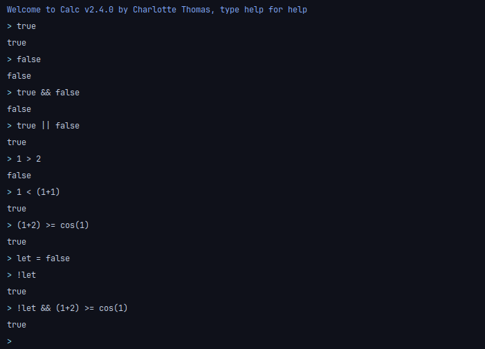

# Logic

You can now use logic! I implemented the following functions:

- or (alias : ||)
- and (alias : &&)
- geq (alias : `>=`)
- gt (alias : `>`)
- leq (alias : `<=`)
- lt (alias :`<`)
- eq (alias : `==`)

## Example:

[LINK TO HOMEPAGE](index.md)
