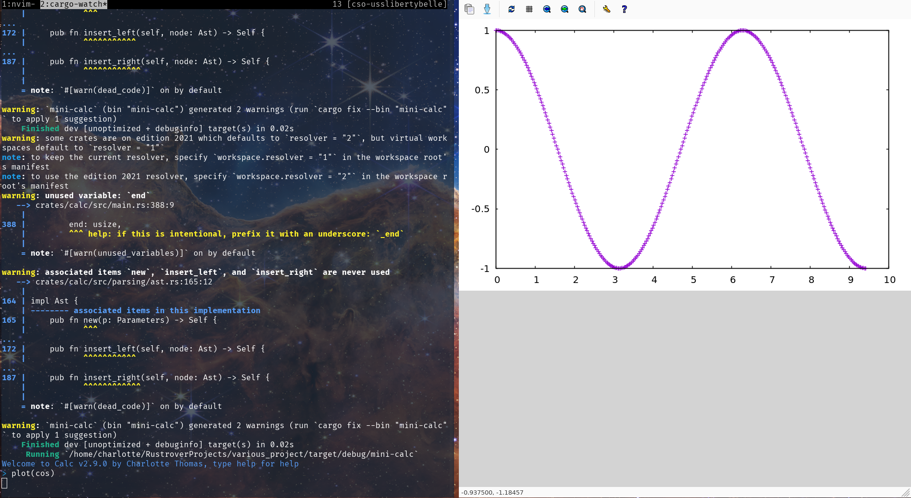
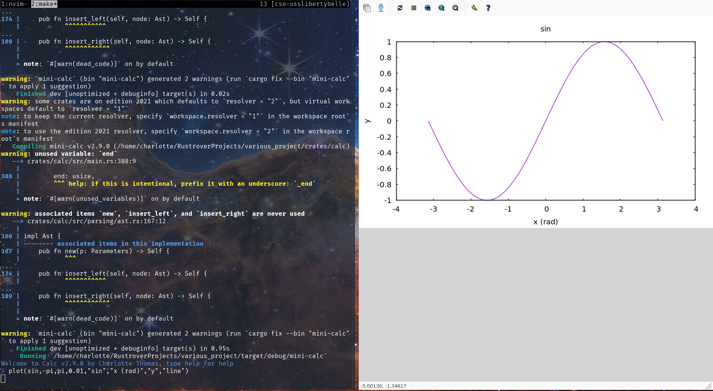
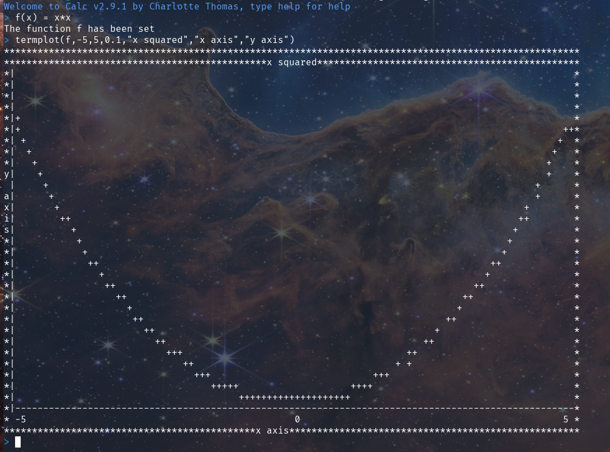

# Plot
You can plot, backend is provided by GNUPlot, so it should work great on linux and macos but behiaviour on windows is not known.

## Help

To display the help just type `help`

## Plot 

### Default

It's easy to plot a function by default, just type `plot(fn)`

### Options

A more difficult plot can be ploted by adding parameters

### Plot your own function

You can plot your function!

## Terminal plotting

You can plot *right into* the terminal! 

### Default

The best example to show it is the square function between -5 and 5 with a 0.1 step. The x axis is automatically scaled but not the y axis for now.

### With option

The terminal supports options!

### Auto y scaling

Now the y axis auto scales, and labels were added in 2.9.2 !

[LINK TO HOMEPAGE](index.md)
