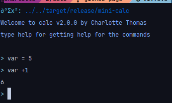

# Usage
you use it as a regular calculator

## Basic Operators

- `+` for the addition
- `-` for the subtraction
- `/` for the division
- `*` for the multiplication
- `^` for the exponentiation

## Setting variable

It's easy to set a variable, just use 
``` 
myvar = value
```
example:
```
myvar = (2+2)
```

[](assets/image.png)

## Built-in variable

- `pi` is pi as a double precision float
- `e` is e as a double precision float


[LINK TO HOMEPAGE](index.md)
