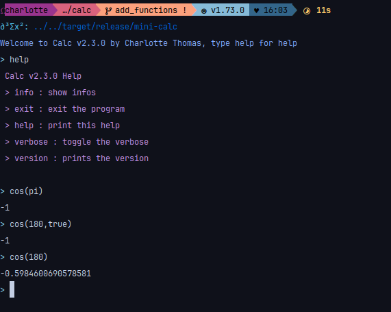
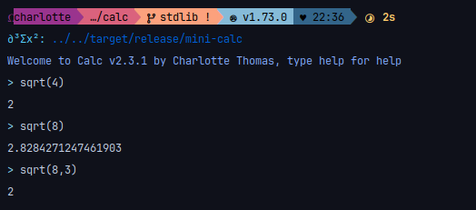
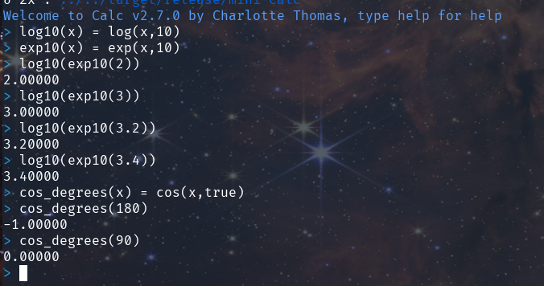

# Functions

The following functions are available

Trigonometry
- sin (vectorized)
- cos (vectorized)
- tan (vectorized)

Hyperbolic trigonometry
- sinh (vectorized)  
- cosh (vectorized)
- tanh (vectorized)

Reverse trigonometry
- asin (vectorized)
- acos (vectorized)
- atan (vectorized)

Exponentiation
- exp (vectorized)
- ln (alias: log) (vectorized)

Vectors
- norm

Matrices
- det 
- invert

Plot
- plot
- termplot

Other
- sqrt (vectorized)
- factorial (aliases: fact or !)
- abs
- ceil
- floor
- round

## Trigonometry

For trigonometry, the input are assumed to be in radian, if not, you have to put "false" or "true" as second argument, example shown bellow

## Exp/ln

If you use the exp function you can pass a second argument for the base you are using, if no second arguments are passed this is assumed to be in natural base

### Root

You can take the nth root with the sqrt function, by default it takes the second root.

### Round

You can round to the nth decimal with the round function, by default it round to the integer (floor)

## Partial function

The language supports partial function

## Vectorization

Function has been vectorized, for example

